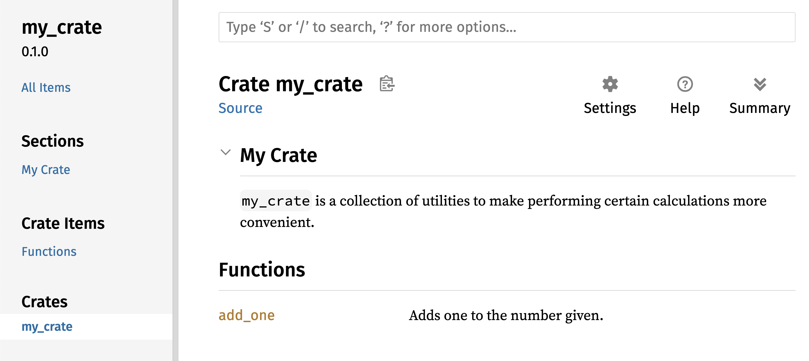

<a id="section-ch14-00-more-about-cargo"></a>

<a id="section-ch14-00-more-about-cargo--more-about-cargo-and-cratesio"></a>

# More About Cargo and Crates.io

[Chapter index](SUMMARY.md)

**In this chapter**

- [Customizing Builds with Release Profiles](#section-ch14-01-release-profiles)
- [Publishing a Crate to Crates.io](#section-ch14-02-publishing-to-crates-io)
- [Cargo Workspaces](#section-ch14-03-cargo-workspaces)
- [Installing Binaries with `cargo install`](#section-ch14-04-installing-binaries)
- [Extending Cargo with Custom Commands](#section-ch14-05-extending-cargo)


So far, we’ve used only the most basic features of Cargo to build, run, and
test our code, but it can do a lot more. In this chapter, we’ll discuss some of
its other, more advanced features to show you how to do the following:

- Customize your build through release profiles.
- Publish libraries on [crates.io](https://crates.io/)<!-- ignore -->.
- Organize large projects with workspaces.
- Install binaries from [crates.io](https://crates.io/)<!-- ignore -->.
- Extend Cargo using custom commands.

Cargo can do even more than the functionality we cover in this chapter, so for
a full explanation of all its features, see [its documentation](https://doc.rust-lang.org/cargo/).

<a id="section-ch14-01-release-profiles"></a>

<a id="section-ch14-01-release-profiles--customizing-builds-with-release-profiles"></a>

## Customizing Builds with Release Profiles

In Rust, _release profiles_ are predefined, customizable profiles with
different configurations that allow a programmer to have more control over
various options for compiling code. Each profile is configured independently of
the others.

Cargo has two main profiles: the `dev` profile Cargo uses when you run `cargo
build`, and the `release` profile Cargo uses when you run `cargo build
--release`. The `dev` profile is defined with good defaults for development,
and the `release` profile has good defaults for release builds.

These profile names might be familiar from the output of your builds:

<!-- manual-regeneration
anywhere, run:
cargo build
cargo build --release
and ensure output below is accurate
-->

```console
$ cargo build
    Finished `dev` profile [unoptimized + debuginfo] target(s) in 0.00s
$ cargo build --release
    Finished `release` profile [optimized] target(s) in 0.32s
```

The `dev` and `release` are these different profiles used by the compiler.

Cargo has default settings for each of the profiles that apply when you haven't
explicitly added any `[profile.*]` sections in the project’s _Cargo.toml_ file.
By adding `[profile.*]` sections for any profile you want to customize, you
override any subset of the default settings. For example, here are the default
values for the `opt-level` setting for the `dev` and `release` profiles:

Filename: Cargo.toml

```toml
[profile.dev]
opt-level = 0

[profile.release]
opt-level = 3
```

The `opt-level` setting controls the number of optimizations Rust will apply to
your code, with a range of 0 to 3. Applying more optimizations extends
compiling time, so if you’re in development and compiling your code often,
you’ll want fewer optimizations to compile faster even if the resultant code
runs slower. The default `opt-level` for `dev` is therefore `0`. When you’re
ready to release your code, it’s best to spend more time compiling. You’ll only
compile in release mode once, but you’ll run the compiled program many times,
so release mode trades longer compile time for code that runs faster. That is
why the default `opt-level` for the `release` profile is `3`.

You can override a default setting by adding a different value for it in
_Cargo.toml_. For example, if we want to use optimization level 1 in the
development profile, we can add these two lines to our project’s _Cargo.toml_
file:

Filename: Cargo.toml

```toml
[profile.dev]
opt-level = 1
```

This code overrides the default setting of `0`. Now when we run `cargo build`,
Cargo will use the defaults for the `dev` profile plus our customization to
`opt-level`. Because we set `opt-level` to `1`, Cargo will apply more
optimizations than the default, but not as many as in a release build.

For the full list of configuration options and defaults for each profile, see
[Cargo’s documentation](https://doc.rust-lang.org/cargo/reference/profiles.html).

<a id="section-ch14-02-publishing-to-crates-io"></a>

<a id="section-ch14-02-publishing-to-crates-io--publishing-a-crate-to-cratesio"></a>

## Publishing a Crate to Crates.io

We’ve used packages from [crates.io](https://crates.io/)<!-- ignore --> as
dependencies of our project, but you can also share your code with other people
by publishing your own packages. The crate registry at
[crates.io](https://crates.io/)<!-- ignore --> distributes the source code of
your packages, so it primarily hosts code that is open source.

Rust and Cargo have features that make your published package easier for people
to find and use. We’ll talk about some of these features next and then explain
how to publish a package.

<a id="section-ch14-02-publishing-to-crates-io--making-useful-documentation-comments"></a>

### Making Useful Documentation Comments

Accurately documenting your packages will help other users know how and when to
use them, so it’s worth investing the time to write documentation. In Chapter
3, we discussed how to comment Rust code using two slashes, `//`. Rust also has
a particular kind of comment for documentation, known conveniently as a
_documentation comment_, that will generate HTML documentation. The HTML
displays the contents of documentation comments for public API items intended
for programmers interested in knowing how to _use_ your crate as opposed to how
your crate is _implemented_.

Documentation comments use three slashes, `///`, instead of two and support
Markdown notation for formatting the text. Place documentation comments just
before the item they’re documenting. Listing 14-1 shows documentation comments
for an `add_one` function in a crate named `my_crate`.

Filename: `src/lib.rs`

> **Example note:** Upstream excludes this example from automated compilation tests; it may be incomplete or require additional context.

```rust
/// Adds one to the number given.
///
/// # Examples
///
/// ```
/// let arg = 5;
/// let answer = my_crate::add_one(arg);
///
/// assert_eq!(6, answer);
/// ```
pub fn add_one(x: i32) -> i32 {
    x + 1
}
```


Listing 14-1: A documentation comment for a function

Here, we give a description of what the `add_one` function does, start a
section with the heading `Examples`, and then provide code that demonstrates
how to use the `add_one` function. We can generate the HTML documentation from
this documentation comment by running `cargo doc`. This command runs the
`rustdoc` tool distributed with Rust and puts the generated HTML documentation
in the _target/doc_ directory.

For convenience, running `cargo doc --open` will build the HTML for your
current crate’s documentation (as well as the documentation for all of your
crate’s dependencies) and open the result in a web browser. Navigate to the
`add_one` function and you’ll see how the text in the documentation comments is
rendered, as shown in Figure 14-1.


Figure 14-1: The HTML documentation for the `add_one`
function

<a id="section-ch14-02-publishing-to-crates-io--commonly-used-sections"></a>

#### Commonly Used Sections

We used the `# Examples` Markdown heading in Listing 14-1 to create a section
in the HTML with the title “Examples.” Here are some other sections that crate
authors commonly use in their documentation:

- **Panics**: These are the scenarios in which the function being documented
  could panic. Callers of the function who don’t want their programs to panic
  should make sure they don’t call the function in these situations.
- **Errors**: If the function returns a `Result`, describing the kinds of
  errors that might occur and what conditions might cause those errors to be
  returned can be helpful to callers so that they can write code to handle the
  different kinds of errors in different ways.
- **Safety**: If the function is `unsafe` to call (we discuss unsafety in
  Chapter 20), there should be a section explaining why the function is unsafe
  and covering the invariants that the function expects callers to uphold.

Most documentation comments don’t need all of these sections, but this is a
good checklist to remind you of the aspects of your code users will be
interested in knowing about.

<a id="section-ch14-02-publishing-to-crates-io--documentation-comments-as-tests"></a>

#### Documentation Comments as Tests

Adding example code blocks in your documentation comments can help demonstrate
how to use your library and has an additional bonus: Running `cargo test` will
run the code examples in your documentation as tests! Nothing is better than
documentation with examples. But nothing is worse than examples that don’t work
because the code has changed since the documentation was written. If we run
`cargo test` with the documentation for the `add_one` function from Listing
14-1, we will see a section in the test results that looks like this:

<!-- manual-regeneration
cd listings/ch14-more-about-cargo/listing-14-01/
cargo test
copy just the doc-tests section below
-->

```text
   Doc-tests my_crate

running 1 test
test src/lib.rs - add_one (line 5) ... ok

test result: ok. 1 passed; 0 failed; 0 ignored; 0 measured; 0 filtered out; finished in 0.27s
```

Now, if we change either the function or the example so that the `assert_eq!`
in the example panics, and run `cargo test` again, we’ll see that the doc tests
catch that the example and the code are out of sync with each other!

<!-- Old headings. Do not remove or links may break. -->

<a id="section-ch14-02-publishing-to-crates-io--commenting-contained-items"></a>

<a id="section-ch14-02-publishing-to-crates-io--contained-item-comments"></a>

#### Contained Item Comments

The style of doc comment `//!` adds documentation to the item that *contains*
the comments rather than to the items *following* the comments. We typically
use these doc comments inside the crate root file (_src/lib.rs_ by convention)
or inside a module to document the crate or the module as a whole.

For example, to add documentation that describes the purpose of the `my_crate`
crate that contains the `add_one` function, we add documentation comments that
start with `//!` to the beginning of the _src/lib.rs_ file, as shown in Listing
14-2.

Filename: `src/lib.rs`

> **Example note:** Upstream excludes this example from automated compilation tests; it may be incomplete or require additional context.

```rust
//! # My Crate
//!
//! `my_crate` is a collection of utilities to make performing certain
//! calculations more convenient.

/// Adds one to the number given.
// --snip--
```


Listing 14-2: The documentation for the `my_crate` crate as a whole

Notice there isn’t any code after the last line that begins with `//!`. Because
we started the comments with `//!` instead of `///`, we’re documenting the item
that contains this comment rather than an item that follows this comment. In
this case, that item is the _src/lib.rs_ file, which is the crate root. These
comments describe the entire crate.

When we run `cargo doc --open`, these comments will display on the front page
of the documentation for `my_crate` above the list of public items in the
crate, as shown in Figure 14-2.

Documentation comments within items are useful for describing crates and
modules especially. Use them to explain the overall purpose of the container to
help your users understand the crate’s organization.



Figure 14-2: The rendered documentation for `my_crate`,
including the comment describing the crate as a whole

<!-- Old headings. Do not remove or links may break. -->

<a id="section-ch14-02-publishing-to-crates-io--exporting-a-convenient-public-api-with-pub-use"></a>

<a id="section-ch14-02-publishing-to-crates-io--exporting-a-convenient-public-api"></a>

### Exporting a Convenient Public API

The structure of your public API is a major consideration when publishing a
crate. People who use your crate are less familiar with the structure than you
are and might have difficulty finding the pieces they want to use if your crate
has a large module hierarchy.

In Chapter 7, we covered how to make items public using the `pub` keyword, and
how to bring items into a scope with the `use` keyword. However, the structure
that makes sense to you while you’re developing a crate might not be very
convenient for your users. You might want to organize your structs in a
hierarchy containing multiple levels, but then people who want to use a type
you’ve defined deep in the hierarchy might have trouble finding out that type
exists. They might also be annoyed at having to enter `use
my_crate::some_module::another_module::UsefulType;` rather than `use
my_crate::UsefulType;`.

The good news is that if the structure _isn’t_ convenient for others to use
from another library, you don’t have to rearrange your internal organization:
Instead, you can re-export items to make a public structure that’s different
from your private structure by using `pub use`. *Re-exporting* takes a public
item in one location and makes it public in another location, as if it were
defined in the other location instead.

For example, say we made a library named `art` for modeling artistic concepts.
Within this library are two modules: a `kinds` module containing two enums
named `PrimaryColor` and `SecondaryColor` and a `utils` module containing a
function named `mix`, as shown in Listing 14-3.

Filename: `src/lib.rs`

> **Example note:** Run this example with Rust's test harness.

```rust
//! # Art
//!
//! A library for modeling artistic concepts.

pub mod kinds {
    /// The primary colors according to the RYB color model.
    pub enum PrimaryColor {
        Red,
        Yellow,
        Blue,
    }

    /// The secondary colors according to the RYB color model.
    pub enum SecondaryColor {
        Orange,
        Green,
        Purple,
    }
}

pub mod utils {
    use crate::kinds::*;

    /// Combines two primary colors in equal amounts to create
    /// a secondary color.
    pub fn mix(c1: PrimaryColor, c2: PrimaryColor) -> SecondaryColor {
        // --snip--
    }
}
```


Listing 14-3: An `art` library with items organized into `kinds` and `utils` modules

Figure 14-3 shows what the front page of the documentation for this crate
generated by `cargo doc` would look like.


Figure 14-3: The front page of the documentation for `art`
that lists the `kinds` and `utils` modules

Note that the `PrimaryColor` and `SecondaryColor` types aren’t listed on the
front page, nor is the `mix` function. We have to click `kinds` and `utils` to
see them.

Another crate that depends on this library would need `use` statements that
bring the items from `art` into scope, specifying the module structure that’s
currently defined. Listing 14-4 shows an example of a crate that uses the
`PrimaryColor` and `mix` items from the `art` crate.

Filename: `src/main.rs`

> **Example note:** Upstream excludes this example from automated compilation tests; it may be incomplete or require additional context.

```rust
use art::kinds::PrimaryColor;
use art::utils::mix;

fn main() {
    let red = PrimaryColor::Red;
    let yellow = PrimaryColor::Yellow;
    mix(red, yellow);
}
```


Listing 14-4: A crate using the `art` crate’s items with its internal structure exported

The author of the code in Listing 14-4, which uses the `art` crate, had to
figure out that `PrimaryColor` is in the `kinds` module and `mix` is in the
`utils` module. The module structure of the `art` crate is more relevant to
developers working on the `art` crate than to those using it. The internal
structure doesn’t contain any useful information for someone trying to
understand how to use the `art` crate, but rather causes confusion because
developers who use it have to figure out where to look, and must specify the
module names in the `use` statements.

To remove the internal organization from the public API, we can modify the
`art` crate code in Listing 14-3 to add `pub use` statements to re-export the
items at the top level, as shown in Listing 14-5.

Filename: `src/lib.rs`

> **Example note:** Upstream excludes this example from automated compilation tests; it may be incomplete or require additional context.

```rust
//! # Art
//!
//! A library for modeling artistic concepts.

pub use self::kinds::PrimaryColor;
pub use self::kinds::SecondaryColor;
pub use self::utils::mix;

pub mod kinds {
    // --snip--
}

pub mod utils {
    // --snip--
}
```


Listing 14-5: Adding `pub use` statements to re-export items

The API documentation that `cargo doc` generates for this crate will now list
and link re-exports on the front page, as shown in Figure 14-4, making the
`PrimaryColor` and `SecondaryColor` types and the `mix` function easier to find.


Figure 14-4: The front page of the documentation for `art`
that lists the re-exports

The `art` crate users can still see and use the internal structure from Listing
14-3 as demonstrated in Listing 14-4, or they can use the more convenient
structure in Listing 14-5, as shown in Listing 14-6.

Filename: `src/main.rs`

> **Example note:** Upstream excludes this example from automated compilation tests; it may be incomplete or require additional context.

```rust
use art::PrimaryColor;
use art::mix;

fn main() {
    // --snip--
}
```


Listing 14-6: A program using the re-exported items from the `art` crate

In cases where there are many nested modules, re-exporting the types at the top
level with `pub use` can make a significant difference in the experience of
people who use the crate. Another common use of `pub use` is to re-export
definitions of a dependency in the current crate to make that crate's
definitions part of your crate’s public API.

Creating a useful public API structure is more an art than a science, and you
can iterate to find the API that works best for your users. Choosing `pub use`
gives you flexibility in how you structure your crate internally and decouples
that internal structure from what you present to your users. Look at some of
the code of crates you’ve installed to see if their internal structure differs
from their public API.

<a id="section-ch14-02-publishing-to-crates-io--setting-up-a-cratesio-account"></a>

### Setting Up a Crates.io Account

Before you can publish any crates, you need to create an account on
[crates.io](https://crates.io/)<!-- ignore --> and get an API token. To do so,
visit the home page at [crates.io](https://crates.io/)<!-- ignore --> and log
in via a GitHub account. (The GitHub account is currently a requirement, but
the site might support other ways of creating an account in the future.) Once
you’re logged in, visit your account settings at
[https://crates.io/me/](https://crates.io/me/)<!-- ignore --> and retrieve your
API key. Then, run the `cargo login` command and paste your API key when prompted, like this:

```console
$ cargo login
abcdefghijklmnopqrstuvwxyz012345
```

This command will inform Cargo of your API token and store it locally in
_~/.cargo/credentials.toml_. Note that this token is a secret: Do not share
it with anyone else. If you do share it with anyone for any reason, you should
revoke it and generate a new token on [crates.io](https://crates.io/)<!-- ignore
-->.

<a id="section-ch14-02-publishing-to-crates-io--adding-metadata-to-a-new-crate"></a>

### Adding Metadata to a New Crate

Let’s say you have a crate you want to publish. Before publishing, you’ll need
to add some metadata in the `[package]` section of the crate’s _Cargo.toml_
file.

Your crate will need a unique name. While you’re working on a crate locally,
you can name a crate whatever you’d like. However, crate names on
[crates.io](https://crates.io/)<!-- ignore --> are allocated on a first-come,
first-served basis. Once a crate name is taken, no one else can publish a crate
with that name. Before attempting to publish a crate, search for the name you
want to use. If the name has been used, you will need to find another name and
edit the `name` field in the _Cargo.toml_ file under the `[package]` section to
use the new name for publishing, like so:

Filename: Cargo.toml

```toml
[package]
name = "guessing_game"
```

Even if you’ve chosen a unique name, when you run `cargo publish` to publish
the crate at this point, you’ll get a warning and then an error:

<!-- manual-regeneration
Create a new package with an unregistered name, making no further modifications
  to the generated package, so it is missing the description and license fields.
cargo publish
copy just the relevant lines below
-->

```console
$ cargo publish
    Updating crates.io index
warning: manifest has no description, license, license-file, documentation, homepage or repository.
See https://doc.rust-lang.org/cargo/reference/manifest.html#package-metadata for more info.
--snip--
error: failed to publish to registry at https://crates.io

Caused by:
  the remote server responded with an error (status 400 Bad Request): missing or empty metadata fields: description, license. Please see https://doc.rust-lang.org/cargo/reference/manifest.html for more information on configuring these fields
```

This results in an error because you’re missing some crucial information: A
description and license are required so that people will know what your crate
does and under what terms they can use it. In _Cargo.toml_, add a description
that's just a sentence or two, because it will appear with your crate in search
results. For the `license` field, you need to give a _license identifier
value_. The [Linux Foundation’s Software Package Data Exchange (SPDX)][section-ch14-02-publishing-to-crates-io-ref-1]
lists the identifiers you can use for this value. For example, to specify that
you’ve licensed your crate using the MIT License, add the `MIT` identifier:

Filename: Cargo.toml

```toml
[package]
name = "guessing_game"
license = "MIT"
```

If you want to use a license that doesn’t appear in the SPDX, you need to place
the text of that license in a file, include the file in your project, and then
use `license-file` to specify the name of that file instead of using the
`license` key.

Guidance on which license is appropriate for your project is beyond the scope
of this book. Many people in the Rust community license their projects in the
same way as Rust by using a dual license of `MIT OR Apache-2.0`. This practice
demonstrates that you can also specify multiple license identifiers separated
by `OR` to have multiple licenses for your project.

With a unique name, the version, your description, and a license added, the
_Cargo.toml_ file for a project that is ready to publish might look like this:

Filename: Cargo.toml

```toml
[package]
name = "guessing_game"
version = "0.1.0"
edition = "2024"
description = "A fun game where you guess what number the computer has chosen."
license = "MIT OR Apache-2.0"

[dependencies]
```

[Cargo’s documentation](https://doc.rust-lang.org/cargo/) describes other
metadata you can specify to ensure that others can discover and use your crate
more easily.

<a id="section-ch14-02-publishing-to-crates-io--publishing-to-cratesio"></a>

### Publishing to Crates.io

Now that you’ve created an account, saved your API token, chosen a name for
your crate, and specified the required metadata, you’re ready to publish!
Publishing a crate uploads a specific version to
[crates.io](https://crates.io/)<!-- ignore --> for others to use.

Be careful, because a publish is _permanent_. The version can never be
overwritten, and the code cannot be deleted except in certain circumstances.
One major goal of Crates.io is to act as a permanent archive of code so that
builds of all projects that depend on crates from
[crates.io](https://crates.io/)<!-- ignore --> will continue to work. Allowing
version deletions would make fulfilling that goal impossible. However, there is
no limit to the number of crate versions you can publish.

Run the `cargo publish` command again. It should succeed now:

<!-- manual-regeneration
go to some valid crate, publish a new version
cargo publish
copy just the relevant lines below
-->

```console
$ cargo publish
    Updating crates.io index
   Packaging guessing_game v0.1.0 (file:///projects/guessing_game)
    Packaged 6 files, 1.2KiB (895.0B compressed)
   Verifying guessing_game v0.1.0 (file:///projects/guessing_game)
   Compiling guessing_game v0.1.0
(file:///projects/guessing_game/target/package/guessing_game-0.1.0)
    Finished `dev` profile [unoptimized + debuginfo] target(s) in 0.19s
   Uploading guessing_game v0.1.0 (file:///projects/guessing_game)
    Uploaded guessing_game v0.1.0 to registry `crates-io`
note: waiting for `guessing_game v0.1.0` to be available at registry
`crates-io`.
You may press ctrl-c to skip waiting; the crate should be available shortly.
   Published guessing_game v0.1.0 at registry `crates-io`
```

Congratulations! You’ve now shared your code with the Rust community, and
anyone can easily add your crate as a dependency of their project.

<a id="section-ch14-02-publishing-to-crates-io--publishing-a-new-version-of-an-existing-crate"></a>

### Publishing a New Version of an Existing Crate

When you’ve made changes to your crate and are ready to release a new version,
you change the `version` value specified in your _Cargo.toml_ file and
republish. Use the [Semantic Versioning rules][section-ch14-02-publishing-to-crates-io-ref-2] to decide what an
appropriate next version number is, based on the kinds of changes you’ve made.
Then, run `cargo publish` to upload the new version.

<!-- Old headings. Do not remove or links may break. -->

<a id="section-ch14-02-publishing-to-crates-io--removing-versions-from-cratesio-with-cargo-yank"></a>
<a id="section-ch14-02-publishing-to-crates-io--deprecating-versions-from-cratesio-with-cargo-yank"></a>

<a id="section-ch14-02-publishing-to-crates-io--deprecating-versions-from-cratesio"></a>

### Deprecating Versions from Crates.io

Although you can’t remove previous versions of a crate, you can prevent any
future projects from adding them as a new dependency. This is useful when a
crate version is broken for one reason or another. In such situations, Cargo
supports yanking a crate version.

_Yanking_ a version prevents new projects from depending on that version while
allowing all existing projects that depend on it to continue. Essentially, a
yank means that all projects with a _Cargo.lock_ will not break, and any future
_Cargo.lock_ files generated will not use the yanked version.

To yank a version of a crate, in the directory of the crate that you’ve
previously published, run `cargo yank` and specify which version you want to
yank. For example, if we’ve published a crate named `guessing_game` version
1.0.1 and we want to yank it, then we’d run the following in the project
directory for `guessing_game`:

<!-- manual-regeneration:
cargo yank carol-test --version 2.1.0
cargo yank carol-test --version 2.1.0 --undo
-->

```console
$ cargo yank --vers 1.0.1
    Updating crates.io index
        Yank guessing_game@1.0.1
```

By adding `--undo` to the command, you can also undo a yank and allow projects
to start depending on a version again:

```console
$ cargo yank --vers 1.0.1 --undo
    Updating crates.io index
      Unyank guessing_game@1.0.1
```

A yank _does not_ delete any code. It cannot, for example, delete accidentally
uploaded secrets. If that happens, you must reset those secrets immediately.

[section-ch14-02-publishing-to-crates-io-ref-1]: https://spdx.org/licenses/
[section-ch14-02-publishing-to-crates-io-ref-2]: https://semver.org/

<a id="section-ch14-03-cargo-workspaces"></a>

<a id="section-ch14-03-cargo-workspaces--cargo-workspaces"></a>

## Cargo Workspaces

In Chapter 12, we built a package that included a binary crate and a library
crate. As your project develops, you might find that the library crate
continues to get bigger and you want to split your package further into
multiple library crates. Cargo offers a feature called _workspaces_ that can
help manage multiple related packages that are developed in tandem.

<a id="section-ch14-03-cargo-workspaces--creating-a-workspace"></a>

### Creating a Workspace

A _workspace_ is a set of packages that share the same _Cargo.lock_ and output
directory. Let’s make a project using a workspace—we’ll use trivial code so
that we can concentrate on the structure of the workspace. There are multiple
ways to structure a workspace, so we'll just show one common way. We’ll have a
workspace containing a binary and two libraries. The binary, which will provide
the main functionality, will depend on the two libraries. One library will
provide an `add_one` function and the other library an `add_two` function.
These three crates will be part of the same workspace. We’ll start by creating
a new directory for the workspace:

```console
$ mkdir add
$ cd add
```

Next, in the _add_ directory, we create the _Cargo.toml_ file that will
configure the entire workspace. This file won’t have a `[package]` section.
Instead, it will start with a `[workspace]` section that will allow us to add
members to the workspace. We also make a point to use the latest and greatest
version of Cargo’s resolver algorithm in our workspace by setting the
`resolver` value to `"3"`:

Filename: Cargo.toml

```toml
[workspace]
resolver = "3"
```

Next, we’ll create the `adder` binary crate by running `cargo new` within the
_add_ directory:

<!-- manual-regeneration
cd listings/ch14-more-about-cargo/output-only-01-adder-crate/add
remove `members = ["adder"]` from Cargo.toml
rm -rf adder
cargo new adder
copy output below
-->

```console
$ cargo new adder
     Created binary (application) `adder` package
      Adding `adder` as member of workspace at `file:///projects/add`
```

Running `cargo new` inside a workspace also automatically adds the newly created
package to the `members` key in the `[workspace]` definition in the workspace
_Cargo.toml_, like this:

```toml
[workspace]
resolver = "3"
members = ["adder"]
```

At this point, we can build the workspace by running `cargo build`. The files
in your _add_ directory should look like this:

```text
├── Cargo.lock
├── Cargo.toml
├── adder
│   ├── Cargo.toml
│   └── src
│       └── main.rs
└── target
```

The workspace has one _target_ directory at the top level that the compiled
artifacts will be placed into; the `adder` package doesn’t have its own
_target_ directory. Even if we were to run `cargo build` from inside the
_adder_ directory, the compiled artifacts would still end up in _add/target_
rather than _add/adder/target_. Cargo structures the _target_ directory in a
workspace like this because the crates in a workspace are meant to depend on
each other. If each crate had its own _target_ directory, each crate would have
to recompile each of the other crates in the workspace to place the artifacts
in its own _target_ directory. By sharing one _target_ directory, the crates
can avoid unnecessary rebuilding.

<a id="section-ch14-03-cargo-workspaces--creating-the-second-package-in-the-workspace"></a>

### Creating the Second Package in the Workspace

Next, let’s create another member package in the workspace and call it
`add_one`. Generate a new library crate named `add_one`:

<!-- manual-regeneration
cd listings/ch14-more-about-cargo/output-only-02-add-one/add
remove `"add_one"` from `members` list in Cargo.toml
rm -rf add_one
cargo new add_one --lib
copy output below
-->

```console
$ cargo new add_one --lib
     Created library `add_one` package
      Adding `add_one` as member of workspace at `file:///projects/add`
```

The top-level _Cargo.toml_ will now include the _add_one_ path in the `members`
list:

Filename: Cargo.toml

```toml
[workspace]
resolver = "3"
members = ["adder", "add_one"]
```

Your _add_ directory should now have these directories and files:

```text
├── Cargo.lock
├── Cargo.toml
├── add_one
│   ├── Cargo.toml
│   └── src
│       └── lib.rs
├── adder
│   ├── Cargo.toml
│   └── src
│       └── main.rs
└── target
```

In the _add_one/src/lib.rs_ file, let’s add an `add_one` function:

Filename: add_one/src/lib.rs

```rust
pub fn add_one(x: i32) -> i32 {
    x + 1
}
```

Now we can have the `adder` package with our binary depend on the `add_one`
package that has our library. First, we’ll need to add a path dependency on
`add_one` to _adder/Cargo.toml_.

Filename: adder/Cargo.toml

```toml
[dependencies]
add_one = { path = "../add_one" }
```

Cargo doesn’t assume that crates in a workspace will depend on each other, so
we need to be explicit about the dependency relationships.

Next, let’s use the `add_one` function (from the `add_one` crate) in the
`adder` crate. Open the _adder/src/main.rs_ file and change the `main`
function to call the `add_one` function, as in Listing 14-7.

Filename: `adder/src/main.rs`

> **Example note:** Upstream excludes this example from automated compilation tests; it may be incomplete or require additional context.

```rust
fn main() {
    let num = 10;
    println!("Hello, world! {num} plus one is {}!", add_one::add_one(num));
}
```


Listing 14-7: Using the `add_one` library crate from the `adder` crate

Let’s build the workspace by running `cargo build` in the top-level _add_
directory!

<!-- manual-regeneration
cd listings/ch14-more-about-cargo/listing-14-07/add
cargo build
copy output below; the output updating script doesn't handle subdirectories in paths properly
-->

```console
$ cargo build
   Compiling add_one v0.1.0 (file:///projects/add/add_one)
   Compiling adder v0.1.0 (file:///projects/add/adder)
    Finished `dev` profile [unoptimized + debuginfo] target(s) in 0.22s
```

To run the binary crate from the _add_ directory, we can specify which package
in the workspace we want to run by using the `-p` argument and the package name
with `cargo run`:

<!-- manual-regeneration
cd listings/ch14-more-about-cargo/listing-14-07/add
cargo run -p adder
copy output below; the output updating script doesn't handle subdirectories in paths properly
-->

```console
$ cargo run -p adder
    Finished `dev` profile [unoptimized + debuginfo] target(s) in 0.00s
     Running `target/debug/adder`
Hello, world! 10 plus one is 11!
```

This runs the code in _adder/src/main.rs_, which depends on the `add_one` crate.

<!-- Old headings. Do not remove or links may break. -->

<a id="section-ch14-03-cargo-workspaces--depending-on-an-external-package-in-a-workspace"></a>

<a id="section-ch14-03-cargo-workspaces--depending-on-an-external-package"></a>

### Depending on an External Package

Notice that the workspace has only one _Cargo.lock_ file at the top level,
rather than having a _Cargo.lock_ in each crate’s directory. This ensures that
all crates are using the same version of all dependencies. If we add the `rand`
package to the _adder/Cargo.toml_ and _add_one/Cargo.toml_ files, Cargo will
resolve both of those to one version of `rand` and record that in the one
_Cargo.lock_. Making all crates in the workspace use the same dependencies
means the crates will always be compatible with each other. Let’s add the
`rand` crate to the `[dependencies]` section in the _add_one/Cargo.toml_ file
so that we can use the `rand` crate in the `add_one` crate:

<!-- When updating the version of `rand` used, also update the version of
`rand` used in these files so they all match:

* ch01-01-installation.md
* ch02-00-guessing-game-tutorial.md
* ch07-04-bringing-paths-into-scope-with-the-use-keyword.md
-->

Filename: add_one/Cargo.toml

```toml
[dependencies]
rand = "0.10.1"
```

We can now add `use rand;` to the _add_one/src/lib.rs_ file, and building the
whole workspace by running `cargo build` in the _add_ directory will bring in
and compile the `rand` crate. We will get one warning because we aren’t
referring to the `rand` we brought into scope:

<!-- manual-regeneration
cd listings/ch14-more-about-cargo/no-listing-03-workspace-with-external-dependency/add
cargo build
copy output below; the output updating script doesn't handle subdirectories in paths properly
-->

```console
$ cargo build
    Updating crates.io index
  Downloaded rand v0.10.1
   --snip--
   Compiling rand v0.10.1
   Compiling add_one v0.1.0 (file:///projects/add/add_one)
warning: unused import: `rand`
 --> add_one/src/lib.rs:1:5
  |
1 | use rand;
  |     ^^^^
  |
  = note: `#[warn(unused_imports)]` (part of `#[warn(unused)]`) on by default

warning: `add_one` (lib) generated 1 warning (run `cargo fix --lib -p add_one` to apply 1 suggestion)
   Compiling adder v0.1.0 (file:///projects/add/adder)
    Finished `dev` profile [unoptimized + debuginfo] target(s) in 0.95s
```

The top-level _Cargo.lock_ now contains information about the dependency of
`add_one` on `rand`. However, even though `rand` is used somewhere in the
workspace, we can’t use it in other crates in the workspace unless we add
`rand` to their _Cargo.toml_ files as well. For example, if we add `use rand;`
to the _adder/src/main.rs_ file for the `adder` package, we’ll get an error:

<!-- manual-regeneration
cd listings/ch14-more-about-cargo/output-only-03-use-rand/add
cargo build
copy output below; the output updating script doesn't handle subdirectories in paths properly
-->

```console
$ cargo build
  --snip--
   Compiling adder v0.1.0 (file:///projects/add/adder)
error[E0432]: unresolved import `rand`
 --> adder/src/main.rs:2:5
  |
2 | use rand;
  |     ^^^^ no external crate `rand`
```

To fix this, edit the _Cargo.toml_ file for the `adder` package and indicate
that `rand` is a dependency for it as well. Building the `adder` package will
add `rand` to the list of dependencies for `adder` in _Cargo.lock_, but no
additional copies of `rand` will be downloaded. Cargo will ensure that every
crate in every package in the workspace using the `rand` package will use the
same version as long as they specify compatible versions of `rand`, saving us
space and ensuring that the crates in the workspace will be compatible with
each other.

If crates in the workspace specify incompatible versions of the same
dependency, Cargo will resolve each of them but will still try to resolve as
few versions as possible.

<a id="section-ch14-03-cargo-workspaces--adding-a-test-to-a-workspace"></a>

### Adding a Test to a Workspace

For another enhancement, let’s add a test of the `add_one::add_one` function
within the `add_one` crate:

Filename: add_one/src/lib.rs

```rust
pub fn add_one(x: i32) -> i32 {
    x + 1
}

#[cfg(test)]
mod tests {
    use super::*;

    #[test]
    fn it_works() {
        assert_eq!(3, add_one(2));
    }
}
```

Now run `cargo test` in the top-level _add_ directory. Running `cargo test` in
a workspace structured like this one will run the tests for all the crates in
the workspace:

<!-- manual-regeneration
cd listings/ch14-more-about-cargo/no-listing-04-workspace-with-tests/add
cargo test
copy output below; the output updating script doesn't handle subdirectories in
paths properly
-->

```console
$ cargo test
   Compiling add_one v0.1.0 (file:///projects/add/add_one)
   Compiling adder v0.1.0 (file:///projects/add/adder)
    Finished `test` profile [unoptimized + debuginfo] target(s) in 0.20s
     Running unittests src/lib.rs (target/debug/deps/add_one-93c49ee75dc46543)

running 1 test
test tests::it_works ... ok

test result: ok. 1 passed; 0 failed; 0 ignored; 0 measured; 0 filtered out; finished in 0.00s

     Running unittests src/main.rs (target/debug/deps/adder-3a47283c568d2b6a)

running 0 tests

test result: ok. 0 passed; 0 failed; 0 ignored; 0 measured; 0 filtered out; finished in 0.00s

   Doc-tests add_one

running 0 tests

test result: ok. 0 passed; 0 failed; 0 ignored; 0 measured; 0 filtered out; finished in 0.00s
```

The first section of the output shows that the `it_works` test in the `add_one`
crate passed. The next section shows that zero tests were found in the `adder`
crate, and then the last section shows that zero documentation tests were found
in the `add_one` crate.

We can also run tests for one particular crate in a workspace from the
top-level directory by using the `-p` flag and specifying the name of the crate
we want to test:

<!-- manual-regeneration
cd listings/ch14-more-about-cargo/no-listing-04-workspace-with-tests/add
cargo test -p add_one
copy output below; the output updating script doesn't handle subdirectories in paths properly
-->

```console
$ cargo test -p add_one
    Finished `test` profile [unoptimized + debuginfo] target(s) in 0.00s
     Running unittests src/lib.rs (target/debug/deps/add_one-93c49ee75dc46543)

running 1 test
test tests::it_works ... ok

test result: ok. 1 passed; 0 failed; 0 ignored; 0 measured; 0 filtered out; finished in 0.00s

   Doc-tests add_one

running 0 tests

test result: ok. 0 passed; 0 failed; 0 ignored; 0 measured; 0 filtered out; finished in 0.00s
```

This output shows `cargo test` only ran the tests for the `add_one` crate and
didn’t run the `adder` crate tests.

If you publish the crates in the workspace to
[crates.io](https://crates.io/)<!-- ignore -->, each crate in the workspace
will need to be published separately. Like `cargo test`, we can publish a
particular crate in our workspace by using the `-p` flag and specifying the
name of the crate we want to publish.

For additional practice, add an `add_two` crate to this workspace in a similar
way as the `add_one` crate!

As your project grows, consider using a workspace: It enables you to work with
smaller, easier-to-understand components than one big blob of code.
Furthermore, keeping the crates in a workspace can make coordination between
crates easier if they are often changed at the same time.

<a id="section-ch14-04-installing-binaries"></a>

<!-- Old headings. Do not remove or links may break. -->

<a id="section-ch14-04-installing-binaries--installing-binaries-from-cratesio-with-cargo-install"></a>

<a id="section-ch14-04-installing-binaries--installing-binaries-with-cargo-install"></a>

## Installing Binaries with `cargo install`

The `cargo install` command allows you to install and use binary crates
locally. This isn’t intended to replace system packages; it’s meant to be a
convenient way for Rust developers to install tools that others have shared on
[crates.io](https://crates.io/)<!-- ignore -->. Note that you can only install
packages that have binary targets. A _binary target_ is the runnable program
that is created if the crate has a _src/main.rs_ file or another file specified
as a binary, as opposed to a library target that isn’t runnable on its own but
is suitable for including within other programs. Usually, crates have
information in the README file about whether a crate is a library, has a
binary target, or both.

All binaries installed with `cargo install` are stored in the installation
root’s _bin_ folder. If you installed Rust using _rustup.rs_ and don’t have any
custom configurations, this directory will be *$HOME/.cargo/bin*. Ensure that
this directory is in your `$PATH` to be able to run programs you’ve installed
with `cargo install`.

For example, in Chapter 12 we mentioned that there’s a Rust implementation of
the `grep` tool called `ripgrep` for searching files. To install `ripgrep`, we
can run the following:

<!-- manual-regeneration
cargo install something you don't have, copy relevant output below
-->

```console
$ cargo install ripgrep
    Updating crates.io index
  Downloaded ripgrep v14.1.1
  Downloaded 1 crate (213.6 KB) in 0.40s
  Installing ripgrep v14.1.1
--snip--
   Compiling grep v0.3.2
    Finished `release` profile [optimized + debuginfo] target(s) in 6.73s
  Installing ~/.cargo/bin/rg
   Installed package `ripgrep v14.1.1` (executable `rg`)
```

The second-to-last line of the output shows the location and the name of the
installed binary, which in the case of `ripgrep` is `rg`. As long as the
installation directory is in your `$PATH`, as mentioned previously, you can
then run `rg --help` and start using a faster, Rustier tool for searching files!

<a id="section-ch14-05-extending-cargo"></a>

<a id="section-ch14-05-extending-cargo--extending-cargo-with-custom-commands"></a>

## Extending Cargo with Custom Commands

Cargo is designed so that you can extend it with new subcommands without having
to modify it. If a binary in your `$PATH` is named `cargo-something`, you can
run it as if it were a Cargo subcommand by running `cargo something`. Custom
commands like this are also listed when you run `cargo --list`. Being able to
use `cargo install` to install extensions and then run them just like the
built-in Cargo tools is a super-convenient benefit of Cargo’s design!

<a id="section-ch14-05-extending-cargo--summary"></a>

## Summary

Sharing code with Cargo and [crates.io](https://crates.io/)<!-- ignore --> is
part of what makes the Rust ecosystem useful for many different tasks. Rust’s
standard library is small and stable, but crates are easy to share, use, and
improve on a timeline different from that of the language. Don’t be shy about
sharing code that’s useful to you on [crates.io](https://crates.io/)<!-- ignore
-->; it’s likely that it will be useful to someone else as well!
